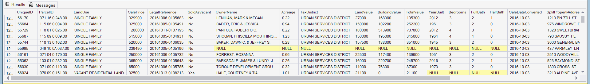
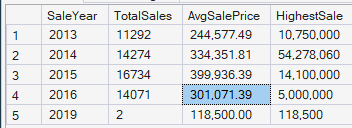

# Data Cleaning in SQL – Nashville Housing Dataset  

  

## Project Overview
Complete **end-to-end data cleaning** project in **SQL Server**. I transformed a raw, messy Nashville Housing dataset (56k+ records) into a clean, production-ready table suitable for downstream analysis, reporting, and visualization.

## Dataset
- **Source**: Nashville Housing Data (public real-estate transactions)  
- **Rows**: 56,416 housing sales records   
- **Challenges**: Missing and inconsistent values, Street Address, City & State in a single column, Excel serial dates, duplicates.

**Raw file**: [Nashville Housing Data for Data Cleaning.xlsx](Nashville%20Housing%20Data%20for%20Data%20Cleaning.xlsx)

## Tools & Technologies
- **SQL Server** (T-SQL)  
- Techniques used: Self-joins, CTEs, Window functions, String manipulation, Date conversion, Data standardization, CASE statements

## What I Cleaned & Transformed
- Converted `SaleDate` (Excel serial) to proper `DATE` format → `SaleDateConverted`  using `TRY_CONVERT`
- Populated missing `PropertyAddress` using **self-join** on `ParcelID`  
- Split addresses into individual components (street, city, state)
- Standardized `SoldAsVacant` column (Y/N → Yes/No) using CASE statement  
- Removed duplicate rows using CTE + `ROW_NUMBER()`
- Deleted duplicate columns (`OwnerAddress`, `PropertyAddress`, `SaleDate`)
- Created indexes on ParcelID and SaleDateCOnverted for faster queries in the future

**Full SQL script**: [housing_queries_final.sql](housing_queries_final.sql)

## Querie Highlights from final script
```sql
-- Safe working copy
IF NOT EXISTS (SELECT * FROM sys.tables WHERE name = 'housing_data_cleaned')
    SELECT * INTO housing_data_cleaned 
    FROM NashvilleHousing;

-- Populate missing addresses (self-join)
UPDATE a
SET a.PropertyAddress = ISNULL(a.PropertyAddress, b.PropertyAddress)
FROM housing_data_cleaned a
JOIN housing_data_cleaned b
    ON a.ParcelID = b.ParcelID
    AND a.UniqueID <> b.UniqueID
WHERE a.PropertyAddress IS NULL;

-- Remove duplicates with CTE
WITH RowNumCTE AS (
    SELECT *,
        ROW_NUMBER() OVER (
            PARTITION BY ParcelID, PropertyAddress, SalePrice, SaleDate, LegalReference
            ORDER BY UniqueID
        ) AS row_num
    FROM housing_data_cleaned
)
DELETE FROM RowNumCTE WHERE row_num > 1;

-- Sample summary query
SELECT 
    YEAR(SaleDateConverted) AS SaleYear,
    COUNT(*) AS TotalSales,
    FORMAT(AVG(SalePrice),'N2') AS AvgSalePrice,
    FORMAT(MAX(SalePrice), 'N0') AS HighestSale
FROM housing_data_cleaned
GROUP BY YEAR(SaleDateConverted)
ORDER BY SaleYear;
```


## Results
    ✅ SaleDate is properly formatted and usable in analysis
    ✅ 0 missing PropertyAddress values
    ✅ All addresses split along street,city and state columns
    ✅ Uniform SoldAsVacant values (Yes/No only)
    ✅ All duplicates removed
    ✅ Database is indexed for faster future queries
    ✅ Cleaned data exported as housing_data_cleaned.csv for next steps

## How to Reproduce
1. Clone the repo
   ``` Bash
    git clone https://github.com/mathyasg/nashville-housing-data-cleaning-sql.git
   
2. Import the Excel file into SQL Server as table **housing_data**
3. Run [housing_queries_final.sql](housing_queries_final.sql) from top to bottom
4. Query the final cleaned table
   ``` sql
   SELECT TOP 100 * FROM housing_data_cleaned ORDER BY SaleDateConverted DESC;

## Next Step 
Exploratory Data Analysis + Visualizations in Python
